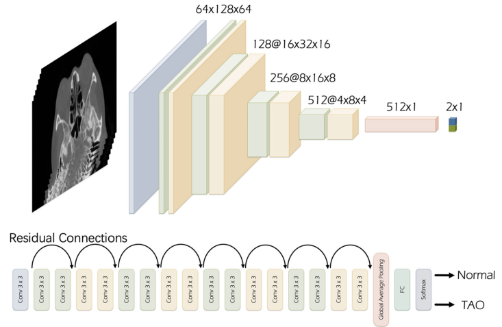

# PyTorch Implementation of Song's ResNet18 (for performance comparison in paper "Multihead Neural Network for Multiple Segmented Images-based Diagnosis of Thyroid-associated Orbitopathy Activity")
 
The preprocessing and architecture can be referenced by a manuscript entitled, "Artificial intelligence CT screening model for thyroid-associated ophthalmopathy and tests under clinical conditions." 

## Overview
This repository contains an unofficial implementation of Song's ResNet using PyTorch.<br/>


## Neural Network Block

## Paper
If you use this software for your research, please cite:

```bibtex
@article{song2021artificial,
  title={Artificial intelligence CT screening model for thyroid-associated ophthalmopathy and tests under clinical conditions},
  author={Song, Xuefei and Liu, Zijia and Li, Lunhao and Gao, Zhongpai and Fan, Xianqun and Zhai, Guangtao and Zhou, Huifang},
  journal={International journal of computer assisted radiology and surgery},
  volume={16},
  pages={323--330},
  year={2021},
  publisher={Springer}
}
```

## License
This program is available for download for non-commercial use, licensed under the GNU General Public License. This allows its use for research purposes or other free software projects but does not allow its incorporation into any type of commercial software.

## Files
The repository contains the following files:
- `GONet.py`: Python script file, containing the PyTorch implementation of the GONet
- `GONet.png`: Figure file for network block
- `README.md`: Markdown file explaining the model source code
